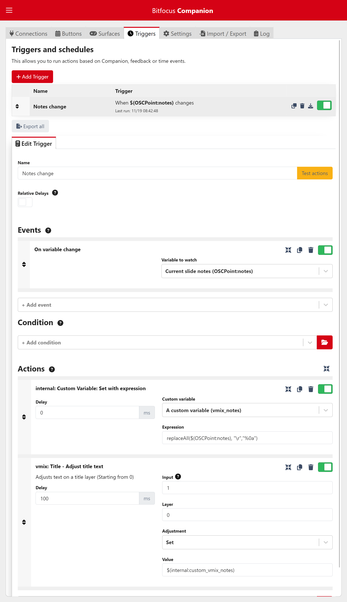

# OSCPoint usage examples

This page contains some examples of how to use the OSCPoint library.

## Using OSCPoint, Companion and vMix to display live notes

> **Want to display live notes but not using vMix?**
> 
> For live events, I recommend you look at [dNotes from IrisDown](https://www.irisdown.co.uk/), which supports auto-text sizing, countdown clocks and main-backup switching.
> 
> For virtual events consider [OctoCue](https://octocue.com), which will share live notes to your presenter's phone.

vMix can be used to display live slide notes by using a title input, and then sending notes text to that input via the vMix API.

To do this you'll need 

- A vMix show file with a title input. This input will need least one text field - this is where we'll place the notes text to display.
- A Companion instance with the vMix and the OSCPoint modules enabled
- A copy of PowerPoint running the OSCPoint add-in, and a presentation with notes

### Basic workflow

The basic workflow within Companion is:

1. For every slide change, the OSCPoint module will update the variable `$(OSCPoint:notes)`
2. We'll setup a trigger in Companion to watch for changes to that variable.
3. When the trigger fires, we'll need to rework the variable a bit fix the line breaks, then send the contents of the variable to vMix via the API.

### Handling line breaks

The main issue we have to solve here is that OSCPoint uses carriage return line breaks (variously `CR`, `\r` or `%0d`). vMix, however, uses line feed line breaks (`LF`, `\n` or `%0a`).

To convert between the two you can use a custom variable in Companion - this will store a vMix-friendly version of the notes. I've called this `vmix_notes`, but you can use an name you like.

### Handling slide changes

Now we need to plumb everything together:

1. Setup a new trigger. This will need to listen to the `On variable change` event, and watch the `$(OSCPoint:notes)` variable.
2. Add your first action to the trigger - this will update the `$(internal:vmix_notes)` variable and change out the `CR` for `LF`s. The action should look like this:  
   - Action: `internal: Custom Variable: Set with expression`
   - Custom variable: `A custom variable (vmix_notes)`
   - Expression: `replaceAll($(OSCPoint:notes), "\r","%0a")`
3. Add your second action to the trigger - this will send the contents of the `$(internal:custom_vmix_notes)` variable to vMix. The action should look like this:
   - Action: `vmix: Title - Adjust title text`
   - Input: `[title input  name, number or GUID]`
   - Layer: `[layer order number for text box in title (0-based)]`
   - Adjustment: `Set`
   - Text: `$(internal:custom_vmix_notes)`

*In the screenshot below I've also added a small delay to the second action - not sure if this is 100% needed - let me know how you get on!*

_Screenshot shows the trigger setup_

### Further actions and ideas

There's currently no way (that I know of) to adjust text size via the vMix API. This means that if you have a lot of text in your notes, it may overflow the text box. You can get around this by using a second title input with a smaller, and then switching between the two inputs as needed.

This could be automated by looking at the length of the notes text, and switching to the smaller input if it's over a certain length.

Ultimately, at some point it'd be better to use IrisDown's [dNotes](https://www.irisdown.co.uk/) software to display notes as this handles font-sizing much better, and includes timers etc. 