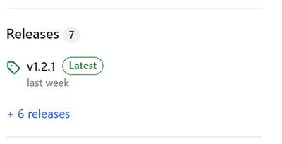
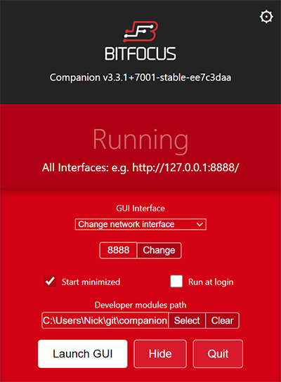

# The OSCPoint Companion module

_A sample Streamdeck layout using the Companion OSCPoint module_

The Companion OSCPoint module (listed as **Zinc: OSCPoint**) simplifies the process of triggering OSCPoint actions and displaying OSCPoint feedbacks by using the popular [Bitfocus Companion software](https://bitfocus.io/companion).

This module is available in builds of Companion v3.2.0+

## Updating the Companion module

New versions of the OSCPoint Companion module are automatically included in new releases of Companion.

However, these only come out a few times a year, so you may wish to manually update your Companion installation to get the latest OSCPoint goodness without having to wait for the Companion update cycle.

To do this, follow these steps:

### 1 - Download the latest module release

1. Navigate to the [GitHub repository](https://github.com/bitfocus/companion-module-zinc-oscpoint.git)
2. Select `Releases` from the side bar and download the latest release zip file.

3. Create a `companion-module-dev folder` somewhere on your computer and unzip the contents of the zip file into this folder.
4. You should end up with the folder structure:  
`[YOUR CHOSEN LOCATION]/companion-module-dev/companion-module-zinc-oscpoint`

### 2 - Setup Companion to use the new module

Launch Companion, select the `cog icon` in the top right to show the developer tools.

In the `Developer modules path` section, click the `Select` button and navigate to the `companion-module-dev` folder you created in step 1.

Companion will scan this folder for modules, find the new OSCPoint module and use this instead of the older, built-in version.

## 3 - Check the module version is correct

Check what version of the OSCPoint module you're running by launching the Companion GUI and navigating to `Connections`.

Scroll down to the `Zinc: OSCPoint` module and click the `i` icon to see the version number.

### Further actions

- [Download Companion](https://bitfocus.io/companion)
- [OSCPoint Companion module on GitHub](https://github.com/bitfocus/companion-module-zinc-oscpoint)
